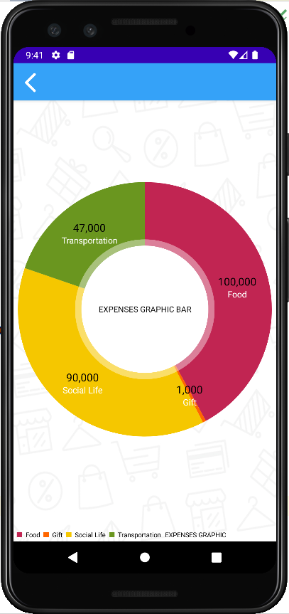

## CATAT UANG - Aplikasi Android
Aplikasi untuk mempermudah dalam pencatatan keuangan 

## Deskripsi Aplikasi
CATAT UANG merupakan sebuah aplikasi untuk mempermudah user dalam melakukan kegiatan pencatatan keuangan agar dapat ditiinjau dan dilacak uang hasil pemasukan (income) dan pengeluaran (expenses) dengan mudah. CATAT UANG berfungsi untuk mengelola keuangan pribadi kita dengan mudah sehingga kita dapat mencatat dan mendokumentasikan transaksi keuangan pribadi ataupun bisnis kita, meninjau data keuangan harian, kita dan mengelola aset keuangan kita.
CATAT UANG juga dapat menampilkan pemasukan dan pengeluaran kita berdasarkan grafik sehingga kita dapat melihat presentase pengeluaran terhadap aset Anda dengan cepat dan kita dapat mengetahui kesimpulan keuangan yang tepat, Aplikasi ini memili fitur registrasi dan login akun, dengan fitur ini hanya pemilik akun yang dapat melihat catatan keuangan dan mengoperasikannya.

## Dukungan Aplikasi
* SQLite – sebagai database untuk menyimpan data user dan data catatan pengeluaran
* Recycler View – menampilkan data dalam bentuk list, diterapkan pada halaman home
* MP Android Chart – untuk mempermudah penyajian data keuangan user, diterapkan pada halaman grafik income dan grafik expenses
* Kamera API–  untuk mempermudah user dalam mendokumentasikan sesuatu, diterapkan pada halaman tambah catatan
* Date Picker – untuk mempermudah user memilih tanggal, diterapkan pada halaman tambah catatan dan edit catatan.
* Splash Screen – untuk memberi tampilan ketika sedang proses loading membuka aplikasi agar lebih menarik

## Screenshot Aplikasi
### 1. Halaman Muat Aplikasi
Halaman ketika proses loading membuka aplikasi, menggunakan splash screen   

### 2. Login
Sebelum menggunakan aplikasi, user harus login terlebih dahulu dengan menginputkan email dan password yang telah terdaftar. Jika user belum memiliki akun, user harus mendaftar terlebih dahulu pada halaman register dengan klik tombol “Daftar”   

### 3. Register
Pada halaman ini user bisa membuat akun untuk masuk ke aplikasi, user harus menginputkan username, email, password dan konfirmasi password. Ketika ada kolom yang belum diisi, email tidak sesuai dengan format, atau kolom konfirmasi password tidak bernilai sama dengan password maka akan  muncul notifikasi. Jika user telah menginputkan data sesuai ketentuan klik tombol register, maka akun akan dibuat dan halaman akan otomatis kembali ke halaman login lagi   

### 4. Home
Terdapat informasi berapa total pengeluaran, pemasukan, dan jumlah saldo user saat ini. Rincian catatan keuangan user disajikan dalam bentu recycler view   

### 5. Tambah Transaksi Income/Expenses
Pada halaman home, tekan button tambah maka akan muncul tampilan halaman tambah catatan. Untuk mencatat pemasukan klik Income, jika ingin mencatat pengeluaran klik Expenses. Masukkan tanggal dengan menekan icon kalender, pilih kategori yang disediakan, masukkan nominal, lalu masukkan catatan, anda juga dapat menambahkan dokumentasi berupa foto pada catatan anda, lalu klik tombol simpan, maka anda akan otomatis kembali ke halaman home dan catatan yang baru saja anda masukkan akan otomatis tampil pada recycle view   
 

### 6. Detail Catatan
User dapat melihat catatan keuangan yang telah dibuat yaitu pada halaman home klik catatan yang ingin di lihat pada list recycle view   

### 7. Edit Catatan
User juga dapat mengedit catatan yang sudah terlanjur dibuat, dengan klik catatan yang akan diedit, dan pilih tombol edit, lalu anda akan masuk ke halaman edit catatan, di halaman edit catatan ini anda bisa mengoreksi tanggal, category, nominal dan catatan tentang keuangan anda, lalu jika sudah benar, klik tombol update, maka otomatis catatan, termasuk hasil income/expenses yg dimasukkan akan otomatis berubah   

### 8. Hapus Catatan
Jika ada catatan yang ingin dihapus, user dapat menghapus catatan dengan klik catatan yang akan dihapus, dan pilih tombol hapus, lalu anda akan ada dialog alert untuk mengonfirmasi apakah user yakin untuk menghapus jika anda yakin ingin menghapus, langsung tekan tombol yes, maka otomatis catatan, termasuk hasil income/outcome yg dimasukkan akan otomatis terhapus    

### 9. Grafik Income
User dapat melihat grafik pemasukkan yang dia dapatkan yaitu pada halaman home pilihlah menu sidebar dan klik menu “grafik income” lalu anda akan masuk ke halaman grafik income, yang berisi grafik pie tentang pemasukan yang dilakukan dibandingkan berdasarkan kategory income   

### 10. Grafik Expenses
User juga dapat melihat grafik pengeluaran yang dia lakukan yaitu pada menu sidebar klik menu “grafik expenses” lalu anda akan masuk ke halaman grafik expenses, yang berisi grafik pie tentang pengeluaran yang dilakukan dibandingkan berdasarkan kategory expenses   

### 13. Logout Account
Terakhir, user dapat keluar dari akunnya dengan klik tombol “log out” pada menu sidebar   

